  

  
    💼 work me: <a href="https://github.com/jarmak-nv"><strong>@jarmak-nv</strong></a>
    &nbsp;·&nbsp;
    🔄 readout auto-refreshed from real commit activity by <a href="generate_smi.py"><code>generate_smi.py</code></a>
  

